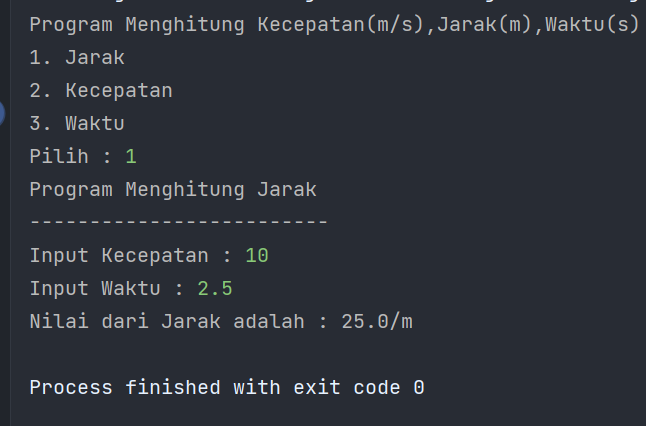

# Laporan Praktikum Pertemuan 1

## 2.2 Pemilihan
Waktu percobaan : 30 menit
Materi pada praktikum ini telah dijelaskan pada matakuliah Dasar Pemrograman, Sehingga 
didalam praktikum ini, tidak akan dilakukan langkah-langkah percobaan. Jawablah pertanyaan-pertanyaan yang ada berikut ini : 
2.2.1 Praktikum Pemilihan
Pertanyaan
1. Buatlah program untuk menghitung nilai akhir dari mahasiswa dengan ketentuan 20% nilai 
tugas, 35% nilai UTS dan 45% nilai UAS. Setiap nilai yang dimasukkan mempunyai batas nilai 
0 ‐ 100. Ketika nilai akhir sudah didapatkan selanjutnya lakukan konversi nilai dengan 
ketentuan sebagai berikut:


## Source code kode program Pemilihan
```import java.util.Scanner;
public class pemilihan {
    public static void main(String[] args) {
    Scanner input = new Scanner(System.in);
        double tugas,uts,uas,finalNilai;
        String gradeNilai = "";
        System.out.println("Program menghitung nilai Akhir");
        System.out.println("==================================");
        System.out.print("Masukkan Nilai Tugas:");
        tugas  = input.nextDouble();
        tugas = tugas*20/100;
        System.out.print("Masukkan Nilai Uts:");
        uts  = input.nextDouble();
        uts = uts*35/100;
        System.out.print("Masukkan Nilai Uas:");
        uas =  input.nextDouble();
        uas = uas*45/100;
        finalNilai= tugas+uas+uts;
        System.out.println("==================================");
        if(finalNilai>80&&finalNilai<=100){
            gradeNilai = "A";
        }else if(finalNilai>73){
            gradeNilai = "B+";
        }else if(finalNilai>65){
            gradeNilai = "B";
        }else if(finalNilai>50){
            gradeNilai = "C+";
        }else if(finalNilai>39){
            gradeNilai="D";
        }else {
            gradeNilai = "E";
        }
        System.out.println("==================================");
        System.out.println("Nilai Akhir : "+finalNilai);
        System.out.println("Nilai Huruf: "+ gradeNilai);
        
        if(gradeNilai.equals("D")||gradeNilai.equals("E")){
            System.out.println("Tidak Lulus");
        }else{
            System.out.println("Lulus");
        }

    }
}
```
## Output program Pemilihan


## 2.3 Perulangan
Waktu percobaan : 30 menit
Materi pada praktikum ini telah dijelaskan pada matakuliah Dasar Pemrograman. Sehingga 
didalam praktikum ini, tidak akan dilakukan langkah-langkah percobaan. Jawablah pertanyaan-pertanyaan yang ada berikut ini : 
2.3.1 Praktikum Perulangan
Pertanyaan
1. Buatlah program yang dapat menampilkan nama hari dari senin hingga minggu secara 
berulang dengan jumlah hari sebesar n, dengan n = 2 digit terakhir NIM anda. 
*bila n<10 maka tambahkan 10 (n+=10)
Contoh:
Input NIM: 2041720010 maka n=10
OUTPUT : senin selasa rabu kamis jumat sabtu minggu senin 
selasa rabu
Contoh 2:
Input NIM: 2041720002 maka n=12
OUTPUT : senin selasa rabu kamis jumat sabtu minggu senin 
selasa rabu kamis jumat
## Source code kode program Perulangan
```
import java.util.Scanner;
public class perulangan {
    public static void main(String[] args) {
        Scanner input = new Scanner(System.in);
        int nim,nimBaru,numberDay;
        System.out.print("Masukkan Nim : ");
        nim = input.nextInt();
        nimBaru = nim%100;
        if(nimBaru<10){
            nimBaru+=10;
        }
        System.out.println("n : "+nimBaru);
        for (int i = 1; i <= nimBaru; i++) {
            numberDay = i%7;
            if(numberDay==1){
                System.out.print("Senin ");
            }else if(numberDay==2){
                System.out.print("Selasa ");
            }else if(numberDay==3){
                System.out.print("Rabu ");
            }else if(numberDay==4){
                System.out.print("Kamis ");
            }else if(numberDay==5){
                System.out.print("Jumat ");
            }else if(numberDay==6){
                System.out.print("Saptu ");
            }else if(numberDay==0){
                System.out.print("Minggu ");
            }
        }
    }
}
```
## Output program Perulangan


## 2.4 Array
Waktu percobaan : 30 menit
Materi pada praktikum ini telah dijelaskan pada matakuliah Dasar Pemrograman, sehingga 
didalam praktikum ini, tidak akan dilakukan langkah-langkah percobaan. Jawablah pertanyaan-pertanyaan yang ada berikut ini : 
2.4.1 Praktikum Array
Pertanyaan
1. RoyalGarden adalah toko bunga yang memiliki banyak cabang. Setiap hari Stock Bunga dan 
bunga-bunga yang dijual selalu dicatat dengan rincian seperti berikut ini:
Baris = Cabang Toko, Kolom = Stock bunga pada hari x


Rincian Harga Aglonema =75.000 , Keladi = 50.000, Alocasia =60.000, Mawar =10.000. 
Bantulah RoyalGarden dengan membuatkan program yang dapat menghitung : 
A. Jumlah Stock berdasarkan jenis bunganya di seluruh Cabang
B. Jika terdapat informasi tambahan berupa pengurangan stock karena bunga tersebut 
mati pada cabang RoyalGarden 1. Dengan rincian Aglonema -1, Keladi -2, Alocasia -0, 
Mawar -5. Maka berapakah total pendapatan dari RoyalGarden 1 jika semua Bunga 
Terjual Habis

## Source code kode program Array
```
public class array {
    public static void main(String[] args) {
        int aglonemaPrice=75_000,keladiPrice=50_000,alocasiaPrice=60_000,mawarPrice=10_000;
        int [][]stockBunga={
                {10,5,15,7},
                {6,11,9,12},
                {2,10,10,5},
                {5,7,12,9},
        };
        String[] jenisBunga={"Aglonema","Keladi","Alocasia","Mawar"};
        String[] cabangToko={"RoyalGarden 1","Royal Garden 2","Royal Garden 3","Royal Garden 4"};

        int aglonemaSum=0,keladiSum=0,alocasiaSum=0,mawarSum=0, totalSum;
        int aglonemaINdex=0,keladiIndex=1,alocasiaIndex=2,mawarIndex=3;
        int royalGarden1=0;
        int totalPendapatan=0;
        for (int i = 0; i <4 ; i++) {
            aglonemaSum = aglonemaSum+ stockBunga[i][aglonemaINdex];
            keladiSum = keladiSum+stockBunga[i][keladiIndex];
            alocasiaSum = alocasiaSum+stockBunga[i][alocasiaIndex];
            mawarSum = mawarSum+stockBunga[i][mawarIndex];
        }
        totalSum=aglonemaSum+keladiSum+alocasiaSum+mawarSum;
        System.out.println("Stok Bunga di Semua cabang : "+totalSum);
        System.out.println("===========================");
        System.out.println("Stock Aglonema: "+aglonemaSum);
        System.out.println("Stock Keladi : "+keladiSum);
        System.out.println("Stcok Alocasia : "+alocasiaSum);
        System.out.println("Stock Mawar : "+mawarSum);
        System.out.println("===========================");
        aglonemaSum=stockBunga[royalGarden1][aglonemaINdex]-1;
        keladiSum=stockBunga[royalGarden1][keladiIndex]-=2;
        alocasiaSum=stockBunga[royalGarden1][alocasiaIndex]-=0;
        mawarSum=stockBunga[royalGarden1][mawarIndex]-=5;

        totalPendapatan=(alocasiaSum*alocasiaPrice)+(aglonemaSum*aglonemaPrice)+(keladiSum*keladiPrice)+(mawarSum*mawarPrice);
        System.out.printf("Total Pendapatan %s :"+totalPendapatan,cabangToko[0]);
        System.out.print("\n");
    }
}
```

## Output program Array


## 2.5 Fungsi
Waktu percobaan : 30 menit
Materi pada praktikum ini telah dijelaskan pada matakuliah Dasar Pemrograman, sehingga 
didalam praktikum ini, tidak akan dilakukan langkah-langkah percobaan. Jawablah pertanyaan-pertanyaan yang ada berikut ini : 
2.5.1 Praktikum Fungsi
Pertanyaan
1. Buatlah fungsi untuk menampilkan array stock bunga sesuai tabel yang terdapat pada 
pertanyaan praktikum bagian 2.4.
2. Buatlah fungsi untuk pada pertanyaan bagian 2.4 untuk mengetahui jumlah Stock 
berdasarkan jenis bunganya di seluruh Cabang
## Source code program Fungsi
```
import  java.util.Scanner;
public class Fungsi {
    public static void main(String[] args) {
        Scanner input = new Scanner(System.in);
        int [][]stockBunga={
                {10,5,15,7},
                {6,11,9,12},
                {2,10,10,5},
                {5,7,12,9},
        };
        String[] jenisBunga={"Aglonema","Keladi","Alocasia","Mawar"};
        String[] cabangToko={"Royal Garden 1","Royal Garden 2","Royal Garden 3","Royal Garden 4"};
        int toko1Index=0,toko2Index=1,toko3Index=2,toko4Index=3;
        boolean isValid = true;
        while(isValid) {
            System.out.println("Selamat Datang di Royal Bunga");
            System.out.println("Silahkan Pilih menu dari kami");
            System.out.println("1.Stock Bunga di Seluruh Cabang");
            System.out.println("2.Stock Bunga per cabang");
            System.out.println("x.Keluar");
            System.out.print("Masukkan pilihan :");
            System.out.print("Cabang toko yang anda pilih: ");
            String pilih = input.nextLine();
            if (pilih.equals("1")) {
                showStock(stockBunga, cabangToko, jenisBunga);
            } else if (pilih.equals("2")) {
                System.out.println("Cabang toko Kami");
                for (int i = 0; i < cabangToko.length; i++) {
                    System.out.println((i+1) + ". " + cabangToko[i]);
                }
                pilih = input.nextLine();
                if (pilih.equals("1")) {
                    showStockPerCabang(stockBunga, jenisBunga, toko1Index, cabangToko);
                } else if (pilih.equals("2")) {
                    showStockPerCabang(stockBunga, jenisBunga, toko2Index, cabangToko);
                } else if (pilih.equals("3")) {
                    showStockPerCabang(stockBunga, jenisBunga, toko3Index, cabangToko);
                } else if (pilih.equals("4")) {
                    showStockPerCabang(stockBunga, jenisBunga, toko4Index, cabangToko);
                } else {
                    isValid = false;
                }
            }else if(pilih.equals("x")){
                isValid=false;
            }
        }

    }
    static void showStock (int[][]stockBunga,String[]cabangToko,String[]jenisBunga){
        System.out.printf("%14s%10s%12s%12s%8s\n","",jenisBunga[0],jenisBunga[1],jenisBunga[2],jenisBunga[3]);
        for(int i=0;i<stockBunga.length;i++){
            System.out.printf("|%10s|",cabangToko[i]);
            for(int j = 0;j<stockBunga[0].length;j++){
                System.out.printf("%10s|",stockBunga[i][j]);
            }
            System.out.println("");
        }
        System.out.print("\n");
    }
    static void showStockPerCabang(int[][]stockBunga,String[] jenisBunga,int indexToko,String[] cabangToko){
        System.out.printf("%14s%12s%12s%12s%8s\n","",jenisBunga[0],jenisBunga[1],jenisBunga[2],jenisBunga[3]);
        System.out.printf("|%10s|",cabangToko[indexToko]);
        for(int i=0;i< jenisBunga.length;i++){
            System.out.printf("%10s|",stockBunga[indexToko][i]);
        }
        System.out.print("\n");
        System.out.print("\n");
    }
}

```
## Output program Fungsi.
1. Fungsi untuk menampilkan array stock bunga sesuai tabel yang terdapat pada 
pertanyaan praktikum bagian 2.4.


2. Fungsi untuk pada pertanyaan bagian 2.4 untuk mengetahui jumlah Stock 
berdasarkan jenis bunganya di seluruh Cabang


## 3. Tugas
### Waktu pengerjaan : 50 menit
1. Sebuah jasa cuci pakaian Smile Laundry memiliki aturan biaya seperti beriku ini 
- Tarif untuk setiap 1kg pakaian adalah Rp. 4.500, –
- Jika customer mencucikan baju lebih dari 10 kg maka : customer akan mendapatkan 
diskon 5%.
Pada hari ini laundy tersebut hanya memiliki 4 customer yaitu Ani, Budi, Bina, dan Cita. Ani 
membawa 4kg pakaian, budi membawa 15kg pakaian, Bina membawa 6kg, dan terakir Cita 
membawa 11kg. Berapakah pendapat Smile laundry pada hari itu? Buatlah programnya

## Source code kode program Tugas 1 Hitung pendapatan cucian.

```
public class Tugas1 {
    public static void main(String[] args) {
        int tarif=4500;
        double diskon = 0.05;
        double pendapatanSmileLaundry=0;
        String [] customer = {"Ani","Budi","Bina","Cita"};
        int [] beratCucian = {4,15,6,11};
        double[] totalHarga = new double[4];
        System.out.println("Program Menghitung Pendapatan Smile Laundry");
        System.out.println("---------------------------");
        for(int i=0;i< beratCucian.length;i++){
            if (beratCucian[i]>10){
                totalHarga[i] = (beratCucian[i]*tarif)-(beratCucian[i]*tarif*diskon);
            }else {
                totalHarga[i] = beratCucian[i]*tarif;
            }
            pendapatanSmileLaundry= pendapatanSmileLaundry+ totalHarga[i];
            System.out.printf("Berat cucian %s = %s",customer[i],beratCucian[i]);
            System.out.print("\n");
            System.out.printf("Total Bayar %s = %s",customer[i],totalHarga[i]);
            System.out.print("\n");
            System.out.println("---------------------------");
        }
        System.out.println("total pendapatan Smile laundry = "+pendapatanSmileLaundry);
    }
}

```
## Output kode program Tugas 1 Smile Laundry.

2. Buat program untuk menghitung rumus kecepatan, jarak, dan waktu
Berikut adalah persamaan untuk menghitung rumus tersebut :
Rumus Kecepatan
𝑣 =
𝑠
𝑡
Rumus Jarak
𝑠 = 𝑣.𝑡
Rumus Waktu
𝑡 =
𝑠
𝑣
Keterangan :
𝑣 = 𝑘𝑒𝑐𝑒𝑝𝑎𝑡𝑎𝑛
𝑠 = 𝑗𝑎𝑟𝑎𝑘
𝑡 = 𝑤𝑎𝑘𝑡𝑢
Program yang dibuat memiliki fungsi sebagai berikut:
a. Menu (Untuk memilih rumus yang akan dihitung (kecepatan/jarak/waktu)
b. Menghitung hasil perhitungan Kecepatan
c. Menghitung hasil perhitungan Jarak
d. Menghitung hasil perhitungan Waktu
Panggil fungsi-fungsi tersebut pada fungsi main!

## Source code program Tugas 2 Menghitung Rumus.
```public class Tugas1 {
    public static void main(String[] args) {
        int tarif=4500;
        double diskon = 0.05;
        double pendapatanSmileLaundry=0;
        String [] customer = {"Ani","Budi","Bina","Cita"};
        int [] beratCucian = {4,15,6,11};
        double[] totalHarga = new double[4];
        System.out.println("Program Menghitung Pendapatan Smile Laundry");
        System.out.println("---------------------------");
        for(int i=0;i< beratCucian.length;i++){
            if (beratCucian[i]>10){
                totalHarga[i] = (beratCucian[i]*tarif)-(beratCucian[i]*tarif*diskon);
            }else {
                totalHarga[i] = beratCucian[i]*tarif;
            }
            pendapatanSmileLaundry= pendapatanSmileLaundry+ totalHarga[i];
            System.out.printf("Berat cucian %s = %s",customer[i],beratCucian[i]);
            System.out.print("\n");
            System.out.printf("Total Bayar %s = %s",customer[i],totalHarga[i]);
            System.out.print("\n");
            System.out.println("---------------------------");
        }
        System.out.println("total pendapatan Smile laundry = "+pendapatanSmileLaundry);
    }
}
```
## Output kode program Menghitung Jarak, Kecepatan, dan Waktu.
a. Menu (Untuk memilih rumus yang akan dihitung (kecepatan/jarak/waktu)

b. Menghitung hasil perhitungan Kecepatan

c. Menghitung hasil perhitungan Jarak

d. Menghitung hasil perhitungan Waktu


## Memanggil Fungsi 
Create Fungsi


### Call Fungsi
a. Fungsi menghitung Jarak
```
 System.out.println("Nilai dari Jarak adalah : "+hitungJarak(velocity,second)+"/m");
```
b. Fungsi menghitung Kecepatan
```
System.out.println("Nilai dari Kecepatan adalah : "+hitungKecepatan(distance,second)+"m/s");
```
c. Fungsi menghitung Waktu
```
System.out.println("Nilai dari Waktu adalah : "+hitungWaktu(distance,velocity)+"/s");
```