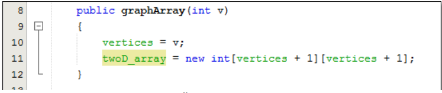

# Laporan Praktikum Pertemuan 13 Graph
## Nama  : Muhamad Rafi Prabowo
## Nim   : 2141720239
## Kelas : TI-1G
## Absen : 20

## **Praktikum 1**
2.1.3 Pertanyaan Percobaan
1. Sebutkan beberapa jenis (minimal 3) algoritma yang menggunakan dasar Graph, dan apakah
   kegunaan algoritma-algoritma tersebut?
  **Algoritma Hopcroft-Karp (untuk penjodoham maksimum)**
   **Algoritma Hungaria (untuk penjodohan sempurna)**
   **Algoritma Brent (untuk menentukan adanya jalur pada graf)**
   **Algoritma Floyd (untuk menentukan adanya jalur pada graf)**
2. Pada class Graph terdapat array bertipe LinkedList, yaitu LinkedList list[]. Apakah tujuan
   pembuatan variabel tersebut ?
   **list tersebut digunakan untuk menyimpan vertex beserta tujuannya, int source di analogikan domainnya dan destinationnya adalah tujuannya**
3. Apakah alasan pemanggilan method addFirst() untuk menambahkan data, bukan method add
   jenis lain pada linked list ketika digunakan pada method addEdge pada class Graph?
   **Karena addFirst disini hanya untuk mengenalkan siapa destinationnya**
4. Bagaimana cara mendeteksi prev pointer pada saat akan melakukan penghapusan suatu edge
   pada graph ?
    **cara mendeteksi prev pointer pada saat akan melakukan penghapusan suatu edge
   pada graph yakni ketika i == destination maka akan di lihat source dari i atau dengan cara melakukan looping
   vertex. Jadi, jika vertex lebih besar dari (i) dan destination sama dengan (i) maka edge akan otomatis dihapus.**
5. Kenapa pada praktikum 2.1.1 langkah ke-12 untuk menghapus path yang bukan merupakan
   lintasan pertama kali menghasilkan output yang salah ? Bagaimana solusinya ?
**Karena pada saat menghapus kita sebenarnnya menghapus indexnnya bukan valued destinationnya, oleh karena itu perlu dilakukan pencarian index dari destinationnya, barulah bisa dihapus atau mungkin karena pada saat kita menambahan datanya telah bergeser karena kita melakukan addFirst()**
## **Praktikum 2**
2.2.3 Pertanyaan Percobaan
1. Apakah perbedaan degree/derajat pada directed dan undirected graph?
  **perbedaan degree/derajat pada directed dan undirected graph yakni kalau pada directed degreeIn
   dengan DegreeOutnya berbeda namun pada undirected degreeIn dengan DegreeOut nya sama. Dpat di
   bedakan juga dari bobotnya juga karena pada directed graph degree mempengaruhi bobot pada edge antar
   vertex. Semisal pada A ke B bobotnya 5 , namun B ke A belum tentu memiliki bobot 5. Sedangkan undirected
   graph degree tidak mempengaruhi bobot**
2. Pada implementasi graph menggunakan adjacency matriks. Kenapa jumlah vertices harus
   ditambahkan dengan 1 pada indeks array berikut?
   
    **karena index di mulai dari 0, sehingga perlu di tambah dengan 1 agar index terakhirnya sama dengan vertexnnya**
3. Apakah kegunaan method getEdge() ?
**kegunaan method getEdge() yekni digunakan untuk menampilkan suatu lintasan yang di perlukan**
4. Termasuk jenis graph apakah uji coba pada praktikum 2.2?
**Termasuk kedalam graph Directed**
5. Mengapa pada method main harus menggunakan try-catch Exception ?
**ketika kita melakukan pemanggilan funsgi yang berpotensi mengakibatkan error maka perlu dijalankan pada block try catch agar error nya bisa ditangkap**

6. **Tugas Praktikum**

## Class Double LinkedList
```java
public class DoubleLinkedLists {
    Node head;
    int size;

    public DoubleLinkedLists() {
        head = null;
        size = 0;
    }

    public boolean isEmpty() {
        return head == null;
    }

    public void addFirst(int item) {
        if (isEmpty()) {
            head = new Node(null, item, null);
        } else {
            Node newNode = new Node(null, item, head);
            head.prev = newNode;
            head = newNode;
        }
        size++;
    }

    public void addLast(int item) {
        if (isEmpty()) {
            addFirst(item);
        } else {
            Node current = head;
            while (current.next != null) {
                current = current.next;
            }
            Node newNode = new Node(current, item, null);
            current.next = newNode;
            size++;
        }
    }

    public void add(int item, int index) throws Exception {
        if (isEmpty()) {
            addFirst(item);
        } else if (index < 0 || index > size) {
            throw new Exception("Nilai indeks di luar batas");
        } else {
            Node current = head;
            int i = 0;
            while (i < index) {
                current = current.next;
                i++;
            }
            if (current.prev == null) {
                Node newNode = new Node(null, item, current);
                current.prev = newNode;
                head = newNode;
            } else {
                Node newNode = new Node(current.prev, item, current);
                newNode.prev = current.prev;
                newNode.next = current;
                current.prev.next = newNode;
                current.prev = newNode;
            }
        }
        size++;
    }

    public int size() {
        return size;
    }

    public void clear() {
        head = null;
        size = 0;
    }

    public void print() {
        if (!isEmpty()) {
            Node tmp = head;
            while (tmp != null) {
                System.out.print(tmp.data + "\t");
                tmp = tmp.next;
            }
            System.out.println("\nberhasil diisi");
        } else {
            System.out.println("Linked Lists kosong");
        }
    }

    public void removeFirst() throws Exception {
        if (isEmpty()) {
            throw new Exception("Linked List masih kosong, tidak dapat dihapus");
        } else if (size == 1) {
            removeLast();
        } else {
            head = head.next;
            head.prev = null;
            size--;
        }
    }

    public void removeLast() throws Exception {
        if (isEmpty()) {
            throw new Exception("Linked List masih kosong, tidak dapat dihapus!");
        } else if (head.next == null) {
            head = null;
            size--;
            return;
        }
        Node current = head;
        while (current.next.next != null) {
            current = current.next;
        }
        current.next = null;
        size--;
    }

    public void remove(int index) throws Exception {
        if (isEmpty() || index >= size) {
            throw new Exception("Nilai indeks di luar baras");
        } else if (index == 0) {
            removeFirst();
        } else {
            Node current = head;
            int i = 0;
            while (i < index) {
                current = current.next;
                i++;
            }
            if (current.next == null) {
                current.prev.next = null;
            } else if (current.prev == null) {
                current = current.next;
                head = current;
            } else {
                current.prev.next = current.next;
                current.next.prev = current.prev;
            }
            size++;
        }
    }

    public int getFirst() throws Exception {
        if (isEmpty()){
            throw new Exception("Linked List kosong");
        }
        return head.data;
    }

    public int getLast() throws Exception {
        if (isEmpty()){
            throw new Exception("Linked List kosong");
        }
        Node tmp = head;
        while (tmp.next != null) {
            tmp = tmp.next;
        }
        return tmp.data;
    }

    public int get(int index) throws Exception {
        if (isEmpty() || index >= size) {
            throw new Exception("Linked List kosong");
        }
        Node tmp = head;
        for (int i = 0; i < index; i++) {
            tmp = tmp.next;
        }
        return tmp.data;
    }
}

```

## Class Graph
```java
public class Graph {
    int vertex;
    boolean tipe;
    DoubleLinkedLists list[];

    public Graph(int vertex, boolean tipe) {
        this.vertex = vertex;
        this.tipe = tipe;
        list = new DoubleLinkedLists[vertex];
        for (int i = 0; i < vertex; i++) {
            list[i] = new DoubleLinkedLists();
        }
    }

    public void addEdge(int source, int destination) {
        if (graphType(tipe)) {
            list[source].addFirst(destination);
        } else {
            list[source].addFirst(destination);
            list[destination].addFirst(source);
        }
    }

    public void degree(int source) throws Exception {
        if(tipe==true){
        System.out.println("degree vertex " + source + " : " + list[source].size());
        
        int k, totalIn = 0, totalOut = 0;
        for (int i = 0; i < vertex; i++) {
            for (int j = 0; j < list[i].size(); j++) {
                if (list[i].get(j) == source)
                    ++totalIn;
            }
            for (k = 0; k < list[source].size(); k++) {
                list[source].get(k);
            }
            totalOut = k;
        }
            System.out.println("Indegree dari vertex " + source + " : " + totalIn);
            System.out.println("Outdegree dari vertex " + source + " : " + totalOut);
            System.out.println("degree dari vertex " + source + " : " + (totalIn + totalOut));
        } else {
            System.out.println("degree vertex " + source + " : " + list[source].size()); 
        }
    }

    public void removeEdge(int source, int destination) throws Exception {
        for (int i = 0; i < list[source].size(); i++) {
            if (destination==list[source].get(i)) {
                list[source].remove(i);
            }
        }
    }

    public void removeAllEdges() {
        for (int i = 0; i < vertex; i++) {
            list[i].clear();
        }
        System.out.println("Graph berhasil dikosongkan");
    }

    public void printGraph() throws Exception {
        for (int i = 0; i < vertex; i++) {
            if (list[i].size() > 0) {
                System.out.print("Vertex " + i + " terhubung dengan: ");
                for (int j = 0; j < list[i].size(); j++) {
                    System.out.print(list[i].get(j) + " ");
                }
                System.out.println("");
            }
        }
        System.out.println(" ");
    }

    public boolean graphType(boolean tipe) {
        return tipe;
    }

    public static void main(String[] args) throws Exception {
        Scanner sc = new Scanner(System.in);
        boolean tp;
        System.out.print("Tipe vertex?\n1. directed\n2. undirected\njawab: ");
        int p = sc.nextInt();
        if (p == 1) {
            tp = true;
        } else {
            tp = false;
        }
        System.out.println("Masukkan jumlah vertex : ");
        int n = sc.nextInt();
        Graph graph = new Graph(n, tp);
        System.out.println("Masukkan vertex <source> <destination>");
        for (int i = 0; i < n + 2; i++) {
            int x = sc.nextInt();
            int y = sc.nextInt();
            graph.addEdge(x, y);
        }
        graph.removeEdge(3, 0);
        graph.printGraph();
        graph.degree(2);
    }
}
```

## Class Node
```java
public class Node {
    int data;
    Node prev, next;

    Node(Node prev, int data, Node next) {
        this.prev = prev;
        this.data = data;
        this.next = next;
    }

```
