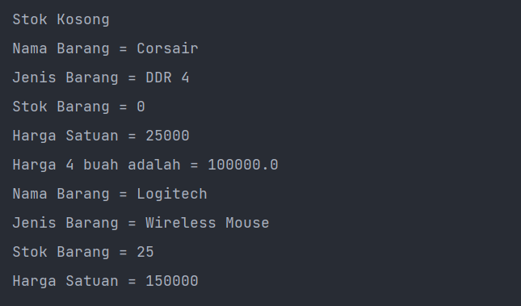
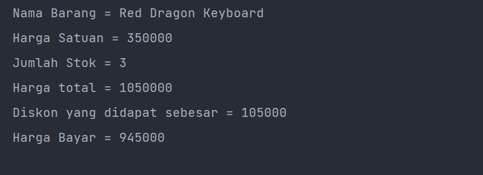
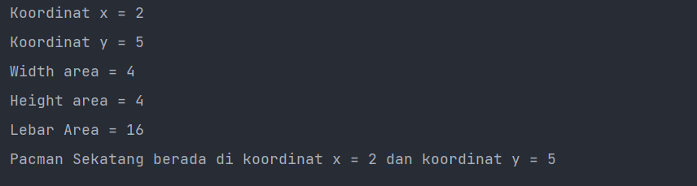

# Laporan Praktikum Algoritman dan Struktur Data
author : Muhamad Rafi Prabowo (TI-1G) 2141720239
## Jawaban Pertanyaan

### 2.2 Deklarasi Class, Atribut, dan Method
1. Karakteristik Kelas atau Objek ada 2 yaitu

    a. Kelas/objek adalah sebuah Gambaran umum dari sebuah objek. Sehingga kelas/objek akan kita jadikan acuan dalam realisasi sebuah objek yang nyata.
    b. Setiap kelas memiliki suatu atribut dan method.

2. Kata kunci apakah yang digunakan untuk mendeklarasikan class/objek ?

    cara deklarasi class

        => class namaClass{

        }

3. Perhatikan class **Barang** yang ada di Praktikum di atas, ada beberapa atribut yang dimiliki oleh class tersebut? Sebutkan! Dan pada baris berapa saja deklarasi atribut dilakukan?
    
    Atribut:
        
        1. Nama Barang : String ->  baris 13.
        2. Jenis Barang : String ->  baris 13.
        3. Stok : int ->  baris 14.
        4. Harga Satuan : int ->  baris 14.
4. Ada berapa method yang dimiliki oleh class tersebut? Sebutkan! Dan pada baris berapa saja 
deklarasi method dilakukan?

        1. tampilBarang() ->  baris 16-21.
        2. tambahStok() ->  baris 23-25.
        3. kurangiStok() ->  baris 27-29.
        4. hitungHargaTotal() ->  baris 31-33.
5. Perhatikan method kurangiStok() yang ada di class Barang, modifikasi isi method tersebut 
sehingga proses pengurangan hanya dilakukan jika stok masih ada (masih lebih besar dari 0) 

code : 

```java
kurangiStock(int n){

if(this.stok >0){
      this.stok = this.stok -n; 
}else {
    System.out.println("Status kurangi stok : Gagal")
    }
}
```
6. Menurut Anda, mengapa method **tambahStok()** dibuat dengan memiliki 1 parameter berupa 
bilangan int?

Karena, ketika kita ingin mengurangi stok maka kita membutuhkan suatu parameter berupa int yang akan kita gunakan sebagai bilangan untuk menambah jumlah stok barang

7. Menurut Anda, mengapa method **hitungHargaTotal()**memiliki tipe data int?

Karena sesuai fungsinya untuk menghitung hitung harga total maka kita membutuhkan sebuah fungsi yang memiliki kembalian berupa perhitungan dari harga total. yang dimana harga total itu merupakan perkalian dari jumlah barang x harga satuan. maka fungsi hitung harga total memakai tipe data int

8. Menurut Anda, mengapa method **tambahStok()** memiliki tipe data void?

    karena tambah stok hanya untuk mengupdate jumlah stok saat ini sehingga hanya perlu memperbarui atribut dari jumlah stok yang ada.

### 2.3 Instansiasi Objek dan Mengakses Atribut & Method

1. Pada class BarangMain, pada baris berapakah proses instansiasi dilakukan? Dan apa nama objek 
yang dihasilkan?

    Instansiasi dilakukan pada baris ke 15.
    
    Nama objek yang dihasilkan adalah **b1**

2. Bagaimana cara mengakses atribut dan method dari suatu objek?

Cara mengakses atribut dari suatu objek kita dapat menggunakan 

-> namaObjek.namaAtribut/namaMethod

### 2.4 Membuat Constructor
1. Perhatikan class Barang yang ada di Praktikum 2.4.1, pada baris berapakah deklarasi 
konstruktor berparameter dilakukan?

        => Pada baris 18

2. Perhatikan class BarangMain di Praktikum 2.4.1, apa sebenarnya yang dilakukan pada baris 
program dibawah ini?

        Barang b2 = new Barang("Logitech","Wireless Mouse",150000,25);

    Kode di atas merupakan inisialisasi objek yang memiliki 4 Constructor. 4 Constructornya sendiri yaitu : 

    1. Nama barang  : String
    2. Jenis barang : String
    3. Harga Satuan : int
    4. Stok         :int


3. Coba buat objek dengan nama b3 dengan menggunakan konstruktor berparameter dari class 
Barang.
        => Barang b3 = new Barang("Red Dragron","Mechanical Keyboard",300000,5);

    
### Verivikasi hasil percobaan

 Kode program

```java
      Barang b1 = new Barang();
        if(b1.stok==0){
            System.out.println("Stok Kosong");
        }
        b1.nama = "Corsair";
        b1.jenis = "DDR 4";
        b1.stok = 0;
        b1.hargaSatuan = 25_000;
        b1.tampilanBarang();
        // b1.tambahStok(2);
        b1.kurangiStok(3);
        double a = b1.hitungHargaTotal(4);
        System.out.println(a);


        Barang b2 = new Barang("Logitech", "Wireless Mouse", 15_0000, 25 );
        b2.tampilanBarang();
        Barang b3 = new Barang("Red Dragron","Mechanical Keyboard",300000,5);
```

Output Kode Program





### 2.5 Latihan Praktikum

## Latihan 1

Source code class Barang

```java
 class Barang {
    String nama;
    int hargaSatuan;
    int jumlah;

    int hargaTotal(){
        return hargaSatuan*jumlah;
    }
    int hitungDiskon(){
        int diskon = hargaTotal();
        if(diskon>100_000){
            diskon = diskon*10/100;
        }else if(diskon >= 5_0000 && diskon <=10_0000 ){
            diskon = diskon*5/100;
        }else {
            diskon = 0;
        }
        return  diskon;
    }
    int hitungHargaBayar(){
        return (hargaTotal()-hitungDiskon());
    }
```

Source code class Barang Main
```java
 public static void main(String[] args) {
        Barang b1 = new Barang();
        b1.nama = "Red Dragon Keyboard";
        b1.hargaSatuan = 35_0000;
        b1.jumlah = 3;
        int a = b1.hargaTotal();
        int b = b1.hitungDiskon();
        int c = b1.hitungHargaBayar();
        System.out.printf("Nama Barang = %-10s\n",b1.nama);
        System.out.printf("Harga Satuan = %-10s\n",b1.hargaSatuan);
        System.out.printf("Jumlah Stok = %-10s \n",b1.jumlah);
        System.out.printf("Harga total = %-10s \n",a);
        System.out.printf("Diskon yang didapat sebesar = %-10s \n",b);
        System.out.printf("Harga Bayar = %-10s \n",c);
```

Output kode Program





## Latihan 2

Pacman Robot

Source code class Pacman
```java
class Pacman {
    int x;
    int y;
    int width;
    int height;
    // Function

    void moveLeft(){
    if( x > 0 && x <=width ){
        x = x - 1;
        System.out.println("move left , x now = "+x);
    }else{
        System.out.println("status : false");
    }
    }
    void moveRight(){
        if( x > 0 && x <=width ){
            x = x + 1;
            System.out.println("move right , x now = "+x);
        }else {
            System.out.println("status : false");
        }
    }
    void moveUp(){
    if(y > 0 && y<= height){
        y=y-1;
        System.out.println("move up , y now = "+y);
    }else{
        System.out.println("status :false");
    }
    }
    void moveDown(){
        if(y > 0 && y<=height){
            y=y+1;
            System.out.println("move down , y now = "+y);
        }else{
            System.out.println("status : false");
        }
    }
    void printPosition(){
        System.out.println("Koordinat x = "+x);
        System.out.println("Koordinat y = "+y);
        System.out.println("Width area = "+width);
        System.out.println("Height area = "+height);
        System.out.println("Lebar Area = "+height*width);
        System.out.printf("Pacman Sekatang berada di koordinat x = %s dan koordinat y = %s\n",x,y);
    }
```

Source code PacmanApp
```java
 Pacman pacman = new Pacman();
        pacman.x = 2;
        pacman.y = 5;
        pacman.width = 4;
        pacman.height = 4;
        pacman.printPosition();
```


Output kode program





