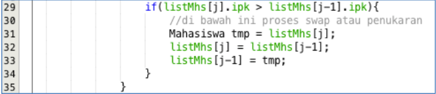
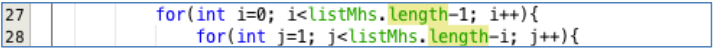
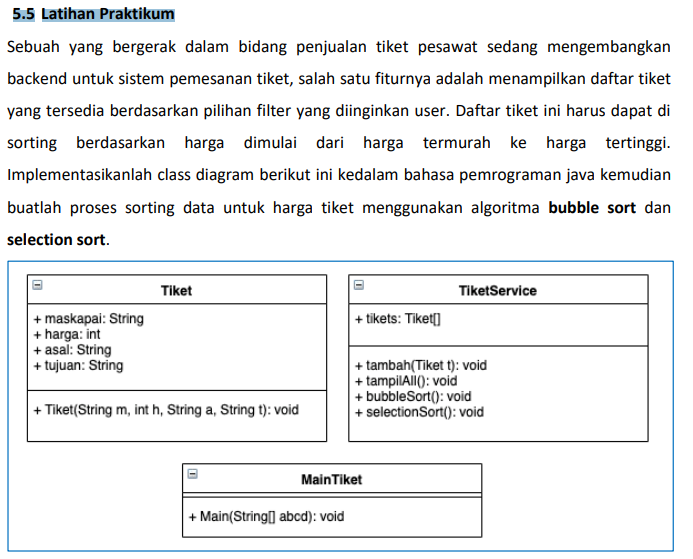

# Laporan Praktikum Praktikum Pertemuan ke-6

### Nama : Muhamad Rafi Prabowo
### Kelas : TI-1G /20
### Nim : 2141720239

## Jawaban pertanyaan Jobsheet 6

# 5.2 Mengurutkan Data Mahasiswa Berdasarkan IPK Menggunakan Bubble Sort
### 5.2.3 Pertanyaan

1. Terdapat di method apakah proses bubble sort?

        Pada class DaftarMahasiswaBerprestasi, baris ke 26 -37, method bubbleSort()
2. Terdapat di method apakah proses selection sort?

        Pada class DaftarMahasiswaBerprestasi, baris ke 40 -53, method selectionSort()
3. Apakah yang dimaksud proses swap? Tuliskan potongan program untuk melakukan
proses swap tersebut!

        Swap merupakan pertukaran antara nilai satu dengan nilai yang lainya 
        contoh swap yaitu 
        Mahasiswa tmp = listMhs[j];
        listMhs[j] = listMhs[j-1];
        listMhs[j-1] = tmp;
4. Di dalam method bubbleSort(), terdapat baris program seperti di bawah ini:


Untuk apakah proses tersebut?

        Proses tersebut melakukan sorting data apakah data pada index ke-j lebih besar dari index ke-j-1, jika iya maka akan dilakukan pertukaran antara data index ke-j dan juga index ke-j-1,dan seterusnya sampai perulangan berakhir
5. Perhatikan perulangan di dalam bubbleSort() di bawah ini:


a. Apakah perbedaan antara kegunaan perulangan i dan perulangan j?

    Perulangan i berfungsi sebagai iterasi untuk melakukan pengurutan data atau bisa dibilang berapa kali melakukan perulangan untuk setiap barisnya atau setiap datanya. Atau untuk iterasi mulai dari data keberapa
b. Mengapa syarat dari perulangan i adalah i<listMhs.length-1 ?

    Karena ketika kita mengurutkan sebuah data, data yang akan diurutkan terakhir akan otomatis terurut
c. Mengapa syarat dari perulangan j adalah j<listMhs.length-i ?

    Karena pada awal proses pengurutan kita membutuhkan banyak kemungkinan pengurutan, ketika beberapa data sudah terurut maka kita akan memiliki sedikit kemungkinan untuk mengurutkannya sehinnga nilai dari j akan semakin berkurang seiring bertambahnya nilai i
d. Jika banyak data di dalam listMhs adalah 50, maka berapakali perulangan i akan
berlangsung? Dan ada berapa Tahap bubble sort yang ditempuh?
     
     Perualngan i nya akan dilakukan 49 kali
     dan tahap bubble sortnya adalah kurang lebih 1225 kali

# 5.3 Mengurutkan Data Mahasiswa Berdasarkan IPK Menggunakan Selection Sort
## 5.3.3. Pertanyaan
Di dalam method selection sort, terdapat baris program seperti di bawah ini:


Untuk apakah proses tersebut, jelaskan!

    Proses tersebut digunakan mencari data terkecil kemudian index dari data tersebut akan disimpan ke dalam variabel idxMin untuk di eksekusi ke proses berikutnya untuk dilakukan swaping

# 5.4 Mengurutkan Data Mahasiswa Berdasarkan IPK Menggunakan Insertion Sort
## 5.4.3 Pertanyaan

Ubahlah fungsi pada InsertionSort sehingga fungsi ini dapat melaksanakan proses sorting
dengan cara ascending atau decending, anda dapat melakukannya dengan menambahkan
parameter pada pemanggilan fungsi insertionSort

```java
 void insertionSort(boolean dsc) {
        for (int i = 1; i < listMahasiswa.length; i++) {
            Mahasiswa tmp = listMahasiswa[i];
            int j = i;
            if (dsc) {
                while (j > 0 && listMahasiswa[j].ipk > listMahasiswa[j - 1].ipk) {
                    listMahasiswa[j] = listMahasiswa[j-1];
                    j--;
                }
                listMahasiswa[j] = tmp;
            } else {
                while (j > 0 && listMahasiswa[j].ipk < listMahasiswa[j - 1].ipk) {
                    listMahasiswa[j] = listMahasiswa[j-1];
                   j--;
                }
                listMahasiswa[j] = tmp;
            }
        }
```


# 5.5 Latihan Praktikum



# Source code
## Class Tiket
```java
package LatihanTiket;

public class Tiket {
    String maskapai;
    int harga;
    String asal;
    String tujuan;
    Tiket(String maskapai,int harga,String asal, String tujuan){
        this.maskapai = maskapai;
        this.harga = harga;
        this.asal = asal;
        this.tujuan = tujuan;
    }

}
```
## Class TiketService
```java
package LatihanTiket;

public class TiketService {
    Tiket tiket[] = new Tiket[5];
    int idx;
    void tambahTiket(Tiket t){
        if(idx< tiket.length){
            tiket[idx] = t;
            idx++;
        }else{
            System.out.println("Data sudah penuh");
        }
    }
    void tampil(){
        for (Tiket t: tiket
             ) {
            System.out.println("Maskapai : "+t.maskapai);
            System.out.println("Harga : Rp."+t.harga);
            System.out.println("Asal : "+t.asal);
            System.out.println("Tujuan : "+t.tujuan);
            System.out.println("-----------------------");
        }
    }
    void bubblesort(){
        for (int i = 0; i < tiket.length-1; i++) {
            for (int j = 1; j < tiket.length-i ; j++) {
                if(tiket[j].harga>tiket[j-1].harga){
                    Tiket temp = tiket[j];
                    tiket[j] = tiket[j-1];
                    tiket[j-1] = temp;
                }
            }
        }
    }
    void selectionsort(){
        for (int i = 0; i < tiket.length-1; i++) {
            int idxMin = i;
            for (int j = i+1; j < tiket.length-1; j++) {
                if(tiket[j].harga<tiket[idxMin].harga){
                    idxMin = j;
                }
                Tiket temp = tiket[idxMin];
                tiket[idxMin] = tiket[i];
                tiket[i] = temp;
            }
        }
    }
}
```
## Program Main
```java
package LatihanTiket;
import  java.util.Scanner;
public class Main {
    public static void main(String[] args) {
        System.out.println("---Program Sorting Harga Tiket ---");
        Tiket garuda = new Tiket("Garuda",1_500_000,"Surabaya","Jakarta");
        Tiket airAsia = new Tiket("Air-Asia",600_000,"Malang","Bali");
        Tiket lion = new Tiket("Lion",800_000,"Surabaya","Balikpapan");
        Tiket sriwijaya = new Tiket("Sriwijaya",750_000,"Malang","Jakarta");
        Tiket etihad = new Tiket("Etihad",15_000_000,"Jakarta","London");

        TiketService tiketService = new TiketService();
        tiketService.tambahTiket(garuda);
        tiketService.tambahTiket(airAsia);
        tiketService.tambahTiket(lion);
        tiketService.tambahTiket(sriwijaya);
        tiketService.tambahTiket(etihad);
        Scanner input = new Scanner(System.in);
        System.out.println("-----Program Pengurutan Tiket-----");
        System.out.println("Silahkan pilih urutan tiket");
        System.out.println("1. Dari termahal ke termurah");
        System.out.println("2. Dari termurah ke termahal");
        System.out.print("pilih : ");
        int pilih;
        pilih = input.nextInt();
        System.out.println("----------------------------");
        System.out.println("====Data tiket sebelum sorting====");
        System.out.println("----------------------------");
        tiketService.tampil();
        if(pilih==1){
            tiketService.bubblesort();
        }else {
            tiketService.selectionsort();
        }
        System.out.println("====Data tiket setelah sorting====");
        System.out.println("----------------------------");
        tiketService.tampil();

    }
}

```

# Output Hasil Program
### Descending
```java
---Program Sorting Harga Tiket ---
-----Program Pengurutan Tiket-----
Silahkan pilih urutan tiket
1. Dari termahal ke termurah
2. Dari termurah ke termahal
pilih : 2
----------------------------
====Data tiket sebelum sorting====
----------------------------
Maskapai : Garuda
Harga : Rp.1500000
Asal : Surabaya
Tujuan : Jakarta
-----------------------
Maskapai : Air-Asia
Harga : Rp.600000
Asal : Malang
Tujuan : Bali
-----------------------
Maskapai : Lion
Harga : Rp.800000
Asal : Surabaya
Tujuan : Balikpapan
-----------------------
Maskapai : Sriwijaya
Harga : Rp.750000
Asal : Malang
Tujuan : Jakarta
-----------------------
Maskapai : Etihad
Harga : Rp.15000000
Asal : Jakarta
Tujuan : London
-----------------------
====Data tiket setelah sorting====
----------------------------
Maskapai : Air-Asia
Harga : Rp.600000
Asal : Malang
Tujuan : Bali
-----------------------
Maskapai : Sriwijaya
Harga : Rp.750000
Asal : Malang
Tujuan : Jakarta
-----------------------
Maskapai : Lion
Harga : Rp.800000
Asal : Surabaya
Tujuan : Balikpapan
-----------------------
Maskapai : Garuda
Harga : Rp.1500000
Asal : Surabaya
Tujuan : Jakarta
-----------------------
Maskapai : Etihad
Harga : Rp.15000000
Asal : Jakarta
Tujuan : London
-----------------------

Process finished with exit code 0
```
### Ascending 
```java"C:\Program Files\Java\jdk-16.0.2\bin\java.exe" "-javaagent:E:\IntelliJ IDEA Community Edition 2021.2.3\lib\idea_rt.jar=54931:E:\IntelliJ IDEA Community Edition 2021.2.3\bin" -Dfile.encoding=UTF-8 -classpath D:\sorting-alogrithm\out\production\sorting-alogrithm LatihanTiket.Main
---Program Sorting Harga Tiket ---
-----Program Pengurutan Tiket-----
Silahkan pilih urutan tiket
1. Dari termahal ke termurah
2. Dari termurah ke termahal
pilih : 1
----------------------------
====Data tiket sebelum sorting====
----------------------------
Maskapai : Garuda
Harga : Rp.1500000
Asal : Surabaya
Tujuan : Jakarta
-----------------------
Maskapai : Air-Asia
Harga : Rp.600000
Asal : Malang
Tujuan : Bali
-----------------------
Maskapai : Lion
Harga : Rp.800000
Asal : Surabaya
Tujuan : Balikpapan
-----------------------
Maskapai : Sriwijaya
Harga : Rp.750000
Asal : Malang
Tujuan : Jakarta
-----------------------
Maskapai : Etihad
Harga : Rp.15000000
Asal : Jakarta
Tujuan : London
-----------------------
====Data tiket setelah sorting====
----------------------------
Maskapai : Etihad
Harga : Rp.15000000
Asal : Jakarta
Tujuan : London
-----------------------
Maskapai : Garuda
Harga : Rp.1500000
Asal : Surabaya
Tujuan : Jakarta
-----------------------
Maskapai : Lion
Harga : Rp.800000
Asal : Surabaya
Tujuan : Balikpapan
-----------------------
Maskapai : Sriwijaya
Harga : Rp.750000
Asal : Malang
Tujuan : Jakarta
-----------------------
Maskapai : Air-Asia
Harga : Rp.600000
Asal : Malang
Tujuan : Bali
-----------------------

Process finished with exit code 0
